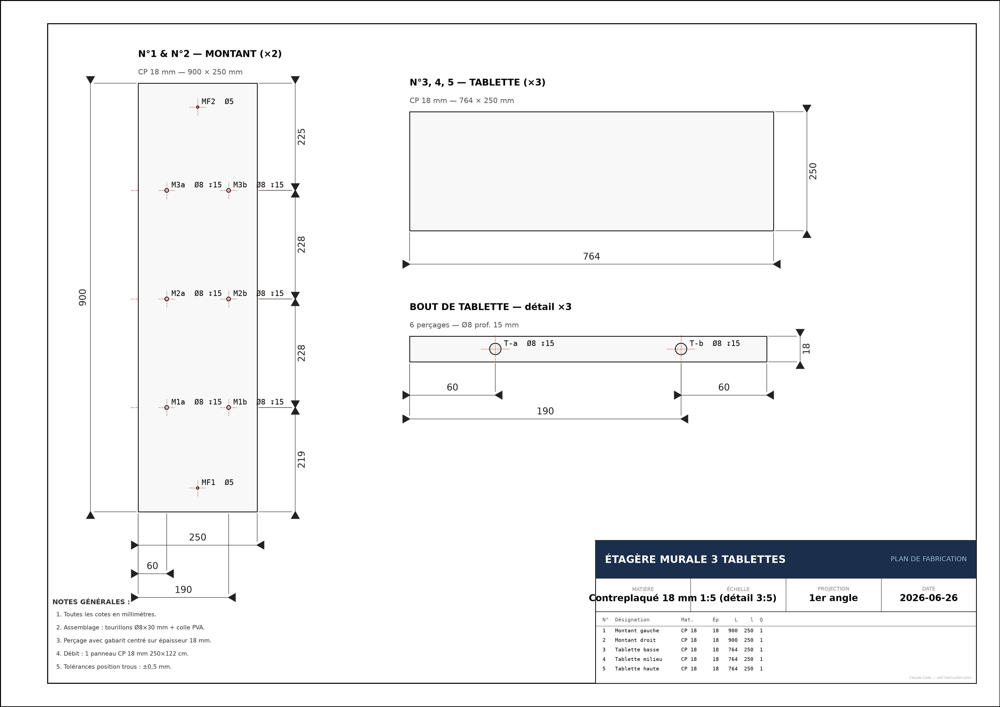

# fabrication-plan

> **Un skill [Claude Code](https://claude.ai/code) qui transforme une description en langage naturel en un dossier de fabrication complet** — dessin technique normalisé ISO, liste de débit, plans de perçage, étapes, outillage.



---

## Ce que ça produit

Pour chaque projet décrit, le skill génère automatiquement :

| Fichier | Contenu |
|---------|---------|
| `plan.png` | Dessin technique normalisé ISO 129-1 — fond blanc, cotations avec flèches, lignes d'axe tiret-point, cartouche, vues de détail |
| `dossier.pdf` | Document complet multi-pages : page de garde · dessin technique intégré · liste de débit · plans de perçage · étapes de fabrication · checklist outillage |

### Le dessin technique

- **Cotation normalisée** — lignes de cote avec flèches aux deux extrémités, lignes d'attache, valeurs au-dessus
- **Lignes d'axe** — tiret-point rouges sur tous les perçages et axes de symétrie
- **Annotation des trous** — `Ø8 ↧15` (diamètre · profondeur)
- **Vues de détail agrandies** — pour les petits éléments (bouts de tablette, assemblages)
- **Cartouche ISO** — matière, échelle, projection, date, liste de débit intégrée
- **Notes générales** — tolérances, instructions d'assemblage

### Le dossier PDF

- Page de garde avec résumé du projet et niveau de difficulté
- Dessin technique en pleine page (A3 paysage intégré)
- Tableau de débit complet (N° · Désignation · Matière · Ép · L · l · Qté)
- Plans de perçage avec coordonnées X/Y depuis bords de référence
- Étapes de fabrication numérotées (couper → percer → assembler → finir)
- Checklist outillage et consommables
- Conseils spécifiques au projet

---

## Installation

```bash
git clone https://github.com/TobieTheUnknown/fabrication-plan ~/.claude/skills/fabrication-plan
```

Les dépendances Python (`matplotlib`, `reportlab`) sont **auto-installées** à la première utilisation.

---

## Usage

Dans Claude Code, décrivez simplement votre projet :

```
/fabrication-plan étagère murale 80×90cm, contreplaqué 18mm, 3 tablettes, tourillons
```

Ou en langage naturel, sans commande :

```
je veux fabriquer un établi d'atelier en hêtre massif 40mm, 160×70cm, pieds pin 70×70mm
```

```
plan de fabrication pour une boîte à outils 30×20×15cm en MDF 10mm, couvercle coulissant
```

```
caisson de rangement pour outils, acier 2mm, 60×40×30cm, soudure MIG, porte pivotante
```

Le skill se déclenche aussi automatiquement quand vous mentionnez des mots comme `tourillons`, `contreplaqué`, `liste de débit`, `plan de perçage`, `gabarit`, etc.

---

## Exemple

Le dossier `examples/` contient un plan complet pour une **étagère murale 3 tablettes** (contreplaqué 18 mm, assemblage par tourillons) :

- [`etagere_murale_plan.png`](examples/etagere_murale_plan.png) — dessin technique A3
- [`etagere_murale_3_tablettes.pdf`](examples/etagere_murale_3_tablettes.pdf) — dossier PDF complet

---

## Matériaux et assemblages supportés

**Bois** — massif (chêne, hêtre, pin, sapin…), contreplaqué, MDF, OSB  
**Métal** — acier, aluminium, inox  
**Assemblages** — tourillons, dominos, mortaises-tenons, vis, boulons, soudure (MIG/TIG/brasage), collage

---

## Structure du skill

```
fabrication-plan/
├── SKILL.md                   ← Instructions pour Claude (lues automatiquement)
├── scripts/
│   ├── render_drawing.py      ← Générateur de dessin technique (matplotlib, ISO 129-1)
│   └── generate_pdf.py        ← Générateur de dossier PDF (reportlab)
├── evals/
│   └── evals.json             ← Cas de test
└── examples/
    ├── etagere_murale_plan.png
    └── etagere_murale_3_tablettes.pdf
```

---

## Licence

MIT — [TobieTheUnknown](https://github.com/TobieTheUnknown)
